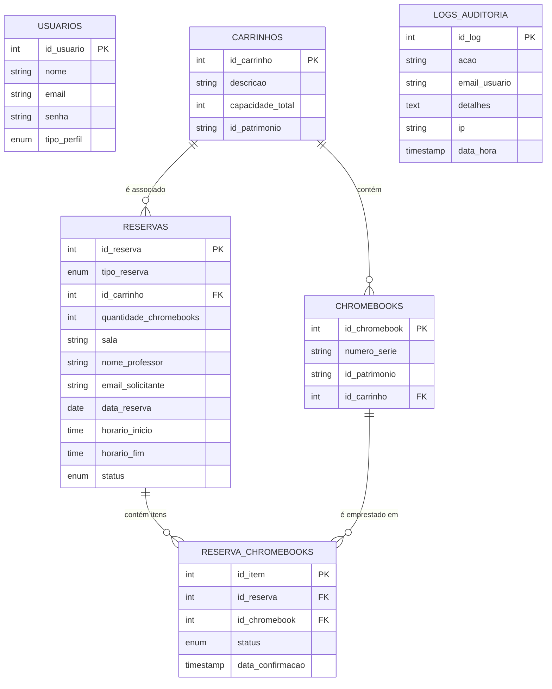
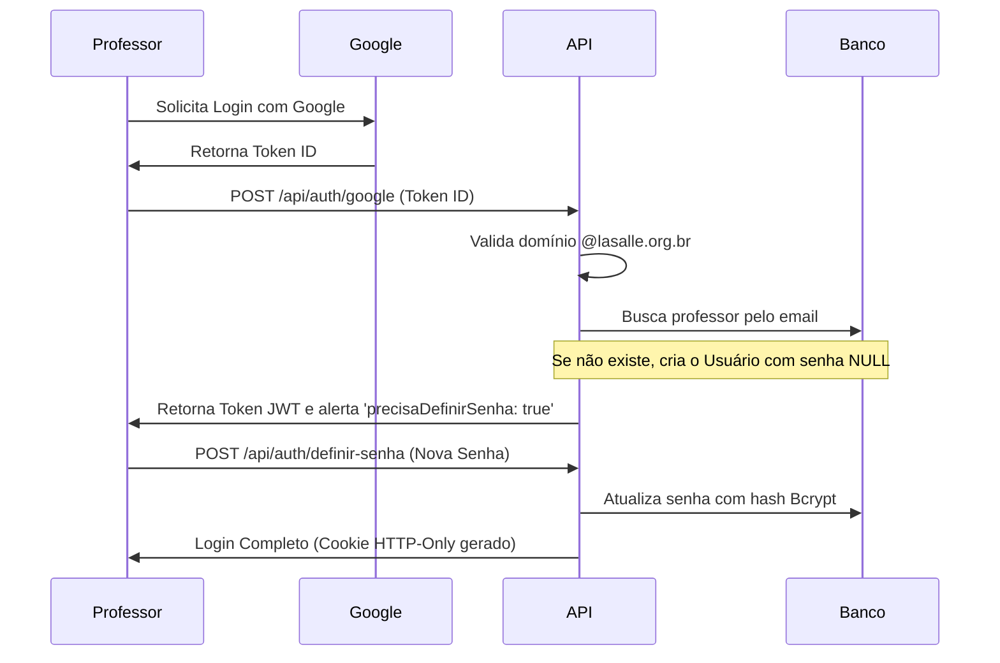
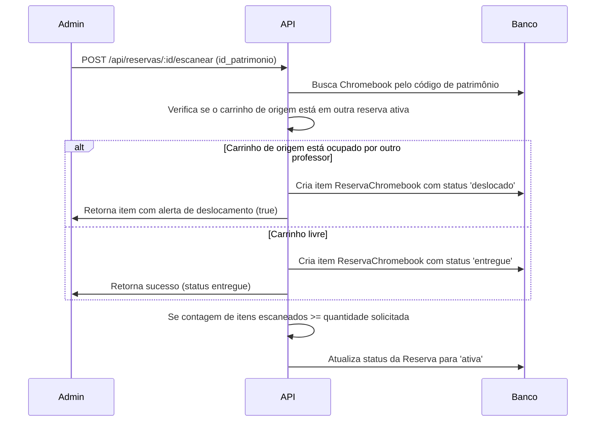

# 💻 Sistema de Reserva de Chromebooks

[](https://nodejs.org/)
[](https://expressjs.com/)
[](https://www.postgresql.org/)
[](https://sequelize.org/)
[](https://www.docker.com/)
[](https://opensource.org/licenses/ISC)

Este é um sistema completo (Full-Stack) para gestão, reserva e auditoria de Chromebooks em instituições de ensino. Projetado especificamente para suprir as demandas de distribuição de dispositivos em salas de aula, o projeto conta com controle de conflito de horários (overbooking), auditoria detalhada de ações, segurança reforçada e um fluxo inteligente de check-out/check-in via escaneamento de patrimônio.

---

## 📌 Índice
1. [Visão Geral & Domínio](#-visão-geral--domínio)
2. [Arquitetura & Tecnologias](#-arquitetura--tecnologias)
3. [Recursos Principais](#-recursos-principais)
4. [Estrutura de Banco de Dados](#-estrutura-de-banco-de-dados)
5. [Segurança & Boas Práticas](#-segurança--boas-práticas)
6. [Estrutura do Projeto](#-estrutura-do-projeto)
7. [Como Executar o Projeto](#-como-executar-o-projeto)
8. [Fluxos de Trabalho (Workflows)](#-fluxos-de-trabalho-workflows)

---

## 📖 Visão Geral & Domínio

Em ambientes escolares, gerenciar o empréstimo de Chromebooks para diferentes turmas de forma organizada é um desafio crítico. O **Reserva-Chromebook** soluciona isso mapeando duas entidades físicas principais:
- **Carrinho (Gabinete Coletivo):** Armários móveis que guardam e carregam grupos de Chromebooks.
- **Chromebook (Dispositivo Individual):** Equipamentos individuais associados a um carrinho de origem.

O sistema permite que professores reservem dispositivos de duas formas:
1. **Reserva de Carrinho:** O professor reserva o armário completo com todos os seus Chromebooks.
2. **Reserva Individual:** O professor solicita uma quantidade exata de dispositivos individuais.

---

## 🛠️ Arquitetura & Tecnologias

A aplicação é modular e segue o padrão **MVC (Model-View-Controller)** para o backend, com entrega de recursos estáticos integrados.

*   **Backend:**
    *   **Node.js & Express:** Servidor robusto configurado na versão 5.x.
    *   **Sequelize ORM:** Camada de abstração e sincronização do banco de dados relacional.
    *   **Zod:** Validação estrita de esquemas e payloads nas requisições.
*   **Frontend:**
    *   **Vanilla JS, HTML5 e CSS3:** Interface responsiva, performática e livre de frameworks pesados para garantir compatibilidade e carregamento instantâneo.
*   **Autenticação:**
    *   **OAuth2 do Google:** Login institucional integrado restrito ao domínio `@lasalle.org.br`.
    *   **JWT (JSON Web Tokens):** Gerenciamento de sessões armazenadas de forma segura em cookies `HTTP-Only`.
    *   **BcryptJS:** Hashing de senhas locais.
*   **Banco de Dados:**
    *   **PostgreSQL:** Armazenamento relacional e transacional de alto desempenho.
*   **Infraestrutura:**
    *   **Docker & Docker Compose:** Orquestração de containers da API, banco PostgreSQL e do Adminer (gerenciador de banco).

---

## 🚀 Recursos Principais

*   **Autenticação Híbrida Inteligente:** Permite login rápido via Google OAuth (com auto-cadastro automático para domínios permitidos) ou login tradicional com e-mail/senha.
*   **Prevenção de Overbooking (Conflitos):** Ao tentar reservar um carrinho, o backend valida se já existe outra reserva ativa ou pendente para o mesmo carrinho no intervalo de tempo especificado.
*   **Scan de Patrimônio para Entrega:**
    *   *Para Carrinhos:* O administrador confirma a saída do carrinho validando o código de patrimônio.
    *   *Para Individuais:* O administrador escaneia Chromebook por Chromebook. Quando a quantidade escaneada atinge o solicitado, o status da reserva muda automaticamente para **Ativa**.
*   **Alerta de Chromebook Deslocado:** Durante o escaneamento individual, se um Chromebook associado a um carrinho reservado por outro professor for escaneado, o sistema registra seu status como `deslocado` e notifica o administrador, impedindo desorganização de carrinhos.
*   **Sincronização de Status (Atraso Automático):** Rotina automática que marca reservas como `atrasada` se o horário limite de devolução expirar.
*   **Trilha de Auditoria Geral:** Cada login, cadastro de reserva, scan de dispositivo ou devolução gera um log detalhado no banco (`logs_auditoria`), salvando o IP do cliente, a ação realizada, o e-mail do autor e o timestamp exato.

---

## 🗄️ Estrutura de Banco de Dados

O banco de dados do sistema baseia-se em 6 tabelas principais integradas por chaves estrangeiras (`foreign keys`) gerenciadas pelo Sequelize:



### Relacionamentos Importantes:
1.  **Carrinhos e Chromebooks:** Um carrinho (`Carrinhos`) possui uma relação de 1 para N com `Chromebooks`.
2.  **Reservas de Carrinho:** Uma `Reserva` pode opcionalmente fazer referência a um `Carrinho` (`id_carrinho`).
3.  **Tabela de Junção (ReservaChromebooks):** Liga a `Reserva` aos `Chromebooks` específicos retirados. Armazena o status individual do empréstimo de cada dispositivo (`entregue`, `devolvido`, `deslocado`).

---

## 🔒 Segurança & Boas Práticas

O projeto foi construído pensando nas melhores diretrizes de segurança de OWASP para APIs REST:
*   **Fail-Safe de Variáveis de Ambiente:** No início da inicialização do `index.js`, um validador verifica se as variáveis críticas (`DATABASE_URL`, `GOOGLE_CLIENT_ID`, `JWT_SECRET`, `CORS_ORIGIN`) estão configuradas. Caso contrário, o servidor encerra a execução imediatamente com um erro detalhado para evitar brechas de segurança.
*   **Helmet CSP e HTTP Headers:** Proteção contra XSS, Clickjacking e outras vulnerabilidades usando cabeçalhos HTTP customizados e política de segurança de conteúdo (CSP) flexível para suportar o fluxo de autenticação do Google.
*   **Cookies HTTP-Only & SameSite:** O token JWT de autenticação é gravado em um cookie inacessível pelo JavaScript do cliente, prevenindo roubos de sessão via ataques XSS.
*   **Rate Limiting:** Limita requisições globais nas rotas da API (máximo de 150 por 15 minutos) e limita tentativas de login/autenticação (máximo de 15 por 15 minutos) contra ataques de força bruta.
*   **Validação de Entrada:** Todas as entradas das rotas principais são validadas usando esquemas do **Zod**, rejeitando dados inválidos antes de atingirem a lógica de negócios ou o banco de dados.

---

## 📂 Estrutura do Projeto

```text
├── src/
│   ├── config/             # Configurações do banco de dados Sequelize
│   ├── controllers/        # Controladores com as regras de negócio
│   ├── middlewares/        # Middlewares de Auth, Admin e Validação de Esquemas
│   ├── models/             # Definição e relações de modelos do Sequelize
│   ├── routes/             # Definição dos endpoints da API REST
│   ├── validators/         # Esquemas de validação do Zod
│   └── index.js            # Arquivo principal de bootstrap e configuração da API
├── public/                 # Arquivos estáticos servidos pelo Express
│   ├── css/                # Estilização da interface
│   ├── js/                 # Scripts do frontend e consumo da API
│   ├── images/             # Recursos de imagem e logotipos
│   ├── index.html          # Ponto de entrada padrão
│   ├── logintela.html      # Tela de login (Google + Local)
│   ├── painel.html         # Dashboard de administração e validação
│   └── reserva.html        # Página de solicitação de reservas
├── Dockerfile              # Configuração da imagem Docker da API Node.js
├── docker-compose.yml      # Orquestração do ecossistema de containers
├── .env.example            # Exemplo de variáveis de ambiente do projeto
└── README.md               # Documentação oficial do projeto
```

---

## ⚡ Como Executar o Projeto

### Pré-requisitos
*   [Docker](https://www.docker.com/) e [Docker Compose](https://docs.docs.com/compose/) instalados em sua máquina.

### Passo 1: Variáveis de Ambiente
Duplique o arquivo `.env.example` para `.env` na raiz do projeto:
```bash
cp .env.example .env
```
Abra o `.env` e preencha as variáveis de ambiente necessárias (como a chave `JWT_SECRET` e o `GOOGLE_CLIENT_ID`).

### Passo 2: Inicialização com Docker
Execute o seguinte comando para construir e inicializar os containers do banco de dados, da API e do Adminer:
```bash
docker-compose up --build
```

Os serviços estarão ativos nos seguintes endereços:
*   **API / Frontend:** `http://localhost:3000`
*   **Adminer (Gerenciador do Banco):** `http://localhost:8080` (Acesse com as credenciais do PostgreSQL definidas no `docker-compose.yml`).

O Sequelize sincronizará e criará automaticamente as tabelas e relacionamentos necessários no banco de dados na primeira execução (`sequelize.sync({ alter: true })`).

---

## 🔄 Fluxos de Trabalho (Workflows)

### 1. Primeiro Acesso do Professor


### 2. Validação Individual de Dispositivos (Admin)


---

## 📄 Licença

Este projeto é distribuído sob a licença **ISC**. Consulte o arquivo `package.json` para obter detalhes.
